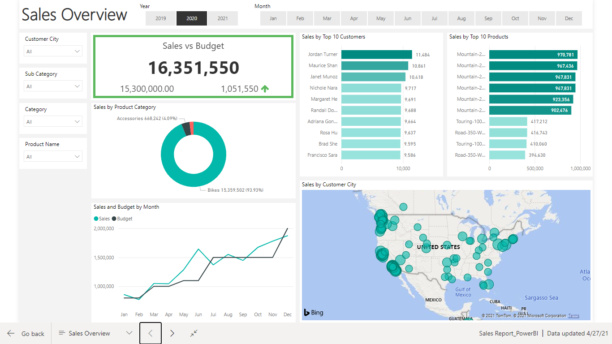
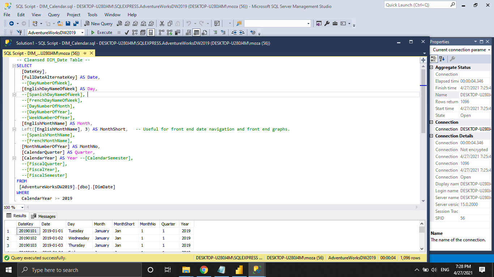

# DataAnalystProject_PBI_SQL

## Introduction
A Full project using SQL, Microsoft Power BI to Generate a Dynamic Visualization.

## Overview
In This Project, we used data from AdventureWorks sample databases restoring them to SQL server exported it in CSV Tables.
And Provide a Dynamic Dashboard and Report helps Sales men and workers in the company to easliy fillter the amont of Sales and budget by Date, Product Categoray and Cutomer City.

## Files
As you can find in this repository 5 csv files which include :
* Exported Data - DIM_Calendar.
* Exported Data - DIM_Customers.
* Exported Data - DIM_Products.
* Exported Data - FACT_InternetSales.
* Sent Over Data - SalesBudget.

### Used Tools
- Microsoft SQL Server
- Microsoft Power BI
- Microsoft Office programms (Excel, Word, Power Point)

### Sources
- [AdventureWorks sample databases].(https://docs.microsoft.com/en-us/sql/samples/adventureworks-install-configure?view=sql-server-ver15&tabs=ssms)
- [![Instagram]](https://docs.microsoft.com/en-us/sql/samples/adventureworks-install-configure?view=sql-server-ver15&tabs=ssms)

#### Find me in social media

